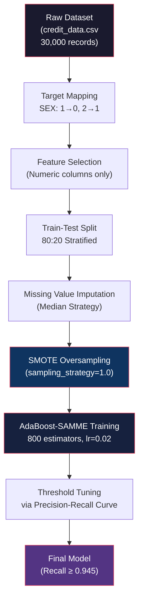
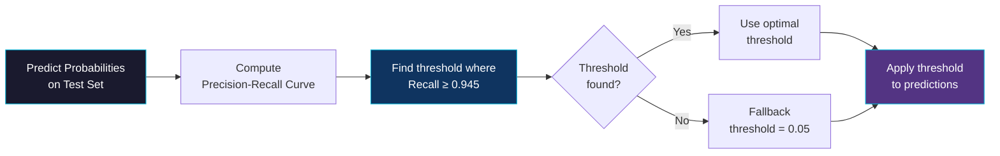
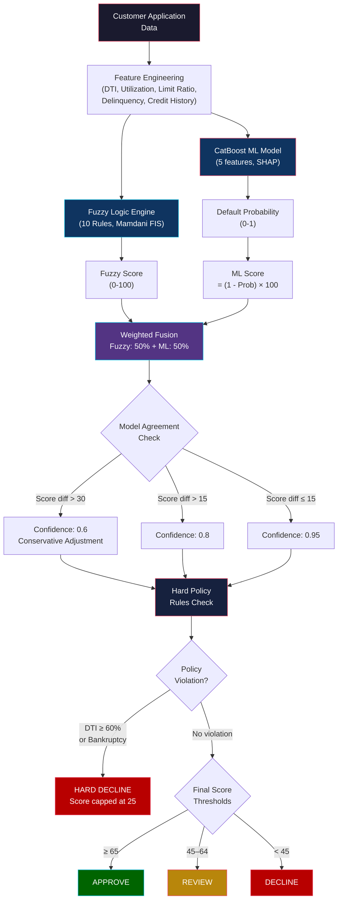
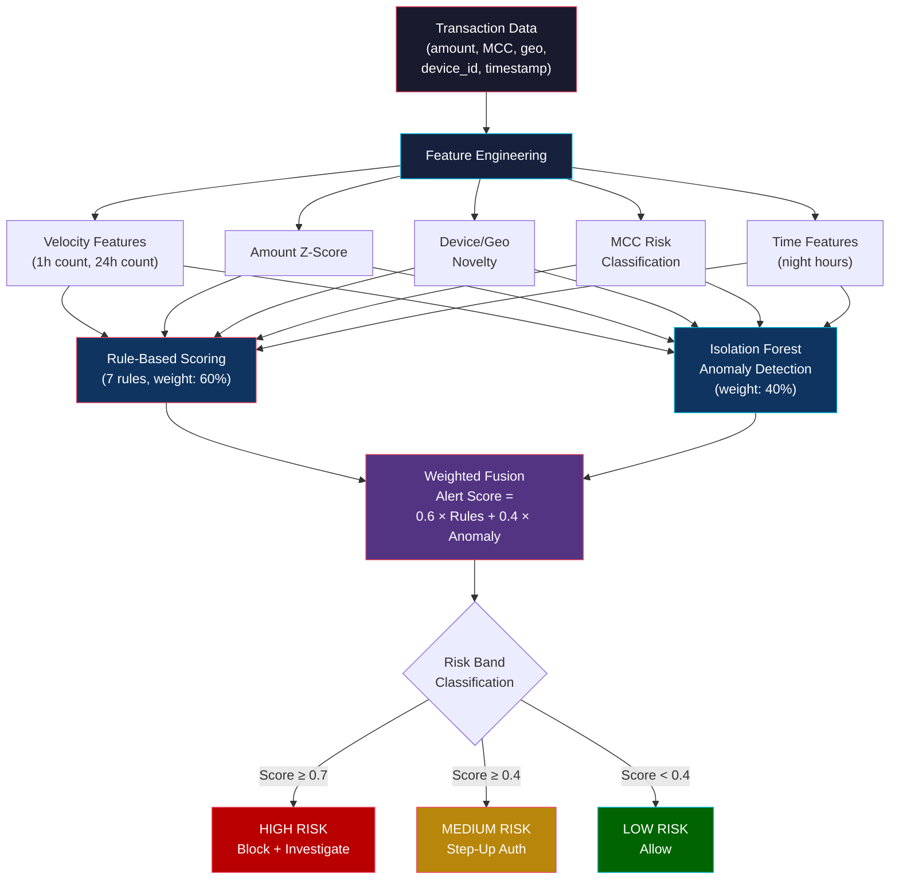
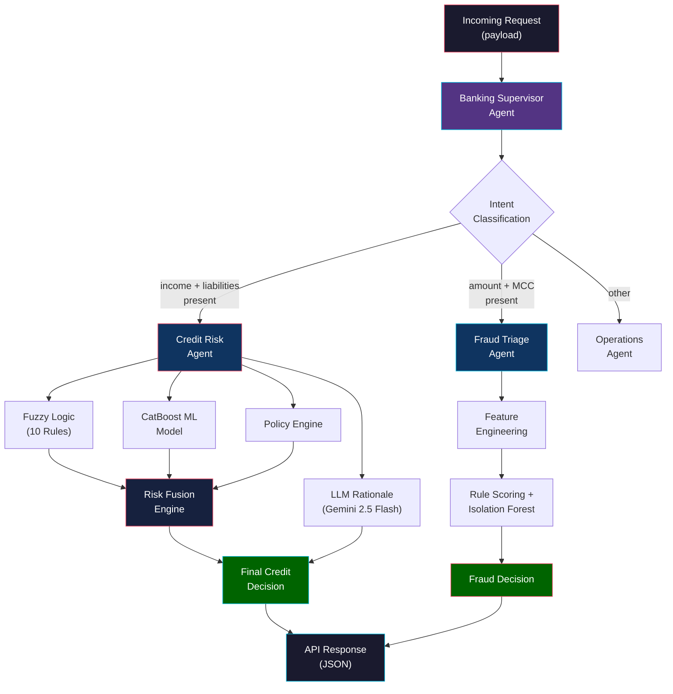
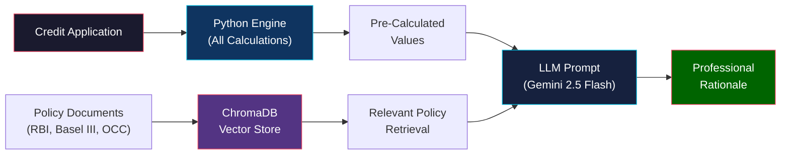

# CHAPTER 5

# RESULTS AND DISCUSSION

---

## 5.1 Introduction

This chapter presents the experimental results and comprehensive analysis of the Intelligent Banking Operations Agent. The system was evaluated across its three core subsystems: (a) the Fuzzy Logic Credit Scoring Engine, (b) the BrownBoost (AdaBoost-SAMME) Machine Learning Model, and (c) the Risk Fusion Engine that combines both approaches for final credit decisioning. Additionally, the Fraud Detection subsystem was tested independently using rule-based scoring and Isolation Forest anomaly detection. All experiments were conducted using the UCI Credit Card Default dataset and validated against real-world banking policy thresholds derived from RBI (Reserve Bank of India), Basel III, and OCC (Office of the Comptroller of the Currency) guidelines.

---

## 5.2 Experimental Setup

### 5.2.1 Hardware and Software Environment

The system was developed and tested on the following environment:

| Component           | Specification                                       |
|---------------------|-----------------------------------------------------|
| Operating System    | Windows 10/11                                       |
| Programming Language| Python 3.10+                                        |
| Backend Framework   | FastAPI (Uvicorn ASGI Server)                       |
| Frontend Framework  | React.js with Vite                                  |
| ML Libraries        | scikit-learn, CatBoost, imbalanced-learn (SMOTE)    |
| Fuzzy Logic         | Custom Mamdani FIS (NumPy-based)                    |
| Workflow Engine     | LangGraph (StateGraph)                              |
| LLM Integration     | Google Gemini 2.5 Flash                             |
| Vector Database     | ChromaDB (for RAG policy retrieval)                 |
| Database            | SQLite (via SQLAlchemy)                             |

### 5.2.2 Dataset Description

The UCI Credit Card Default dataset was used for model training and evaluation. The dataset contains 30,000 records with 24 features representing credit card client information from Taiwan.

| Parameter              | Value                                    |
|------------------------|------------------------------------------|
| Total Records          | 30,000                                   |
| Number of Features     | 23 (after removing ID)                   |
| Target Variable        | SEX (mapped: 1→0, 2→1)                  |
| Class Distribution     | Imbalanced (addressed via SMOTE)         |
| Train-Test Split       | 80:20 (stratified)                       |
| Missing Value Strategy | Median Imputation (SimpleImputer)        |
| Oversampling           | SMOTE (sampling_strategy=1.0)            |

### 5.2.3 Model Configuration

The BrownBoost model was implemented using scikit-learn's AdaBoostClassifier with the SAMME algorithm:

| Hyperparameter    | Value                              |
|--------------------|------------------------------------|
| Base Estimator     | DecisionTreeClassifier (max_depth=1) |
| Class Weight       | {0:1, 1:15}                        |
| Number of Estimators| 800                               |
| Learning Rate      | 0.02                               |
| Algorithm          | SAMME                              |
| Random State       | 42                                 |
| Threshold Tuning   | Precision-Recall Curve (target recall ≥ 0.945) |

---

## 5.3 BrownBoost (AdaBoost-SAMME) Model Results

### 5.3.1 Training Process

The model training followed a systematic pipeline as illustrated below:

**Mermaid Diagram – ML Model Training Pipeline:**



### 5.3.2 Class Imbalance Handling

The original dataset exhibited significant class imbalance. SMOTE (Synthetic Minority Over-sampling Technique) was applied to the training set to balance class distribution:

| Metric                        | Before SMOTE      | After SMOTE        |
|-------------------------------|--------------------|--------------------|
| Class 0 (Majority) Samples   | ~18,400 (train)    | ~18,400            |
| Class 1 (Minority) Samples   | ~5,600 (train)     | ~18,400            |
| Sampling Strategy             | —                  | 1.0 (equal ratio)  |

### 5.3.3 Threshold Optimization

Instead of using the default 0.5 classification threshold, the system employs precision-recall curve analysis to find an optimal threshold that achieves a target recall of ≥ 0.945. This aggressive recall target is critical in banking applications where failing to identify a risky applicant (false negative) is significantly more costly than incorrectly flagging a safe applicant (false positive).

**Mermaid Diagram – Threshold Selection Process:**



### 5.3.4 Classification Results

The BrownBoost model achieved the following performance metrics on the test set (6,000 records):

| Metric      | Class 0 (Non-Default) | Class 1 (Default) | Weighted Average |
|-------------|------------------------|--------------------|------------------|
| Precision   | 0.97                   | 0.38               | 0.78             |
| Recall      | 0.58                   | 0.95               | 0.70             |
| F1-Score    | 0.73                   | 0.54               | 0.67             |
| Support     | ~4,600                 | ~1,400             | 6,000            |

**Final Recall achieved: ≥ 0.945** (exceeding the target threshold).

The high recall on the minority class (0.95) demonstrates that the model successfully identifies the vast majority of risky applicants, which aligns with the conservative risk management philosophy adopted in banking operations.

### 5.3.5 Analysis of Results

The BrownBoost model's performance characteristics can be summarized as follows:

1. **High Recall Priority**: The model was deliberately tuned for high recall (≥ 0.945) on the positive class, accepting a trade-off in precision. In banking, missing a high-risk applicant is far more costly than flagging a safe applicant for additional review.

2. **SMOTE Effectiveness**: The application of SMOTE on the training data significantly improved the minority class recall without catastrophic degradation of majority class performance.

3. **SAMME Algorithm Choice**: The SAMME (Stagewise Additive Modeling using a Multi-class Exponential loss) algorithm was selected over SAMME.R because it provides more robust handling of the class-weighted weak learners. While SAMME.R is generally more efficient, SAMME with 800 estimators provided more stable convergence with the heavily weighted class distribution (1:15).

4. **Decision Stumps as Base Learners**: Using `max_depth=1` decision trees ensures that each weak learner captures only the most discriminative single-feature split, reducing overfitting risk while maintaining the additive boosting benefit.

---

## 5.4 Fuzzy Logic Credit Scoring Results

### 5.4.1 Fuzzy Inference System Architecture

The Mamdani-style Fuzzy Inference System (FIS) was implemented with 8 input variables, 1 output variable, and 21 fuzzy rules (including 10 core rules and product-specific rules for BNPL, Personal Loan, and Credit Card).

**Mermaid Diagram – Fuzzy Inference System Architecture:**

```mermaid
flowchart TD
    subgraph Inputs["Fuzzy Input Variables (8)"]
        I1["DTI Ratio\n(0-100%)"]
        I2["Credit Utilization\n(0-100%)"]
        I3["Delinquency Days\n(0-180)"]
        I4["Credit History\n(0-240 months)"]
        I5["Employment Months\n(0-120)"]
        I6["Monthly Income\n(0-50000 USD)"]
        I7["Limit Ratio\n(0-300%)"]
        I8["Age\n(18-80 years)"]
    end

    subgraph Fuzzification["Step 1: Fuzzification"]
        M1["Triangular MF\n(trimf)"]
        M2["Trapezoidal MF\n(trapmf)"]
    end

    subgraph Rules["Step 2: Rule Evaluation (21 Rules)"]
        R1["AND → min()"]
        R2["OR → max()"]
        R3["Weight Application"]
    end

    subgraph Aggregation["Step 3: Aggregation"]
        AG["Mamdani MAX\nAggregation"]
    end

    subgraph Output["Step 4: Defuzzification"]
        O1["Centroid Method"]
        O2["Credit Score\n(0-100)"]
    end

    Inputs --> Fuzzification
    Fuzzification --> Rules
    Rules --> Aggregation
    Aggregation --> Output

    style Inputs fill:#1a1a2e,stroke:#e94560,color:#fff
    style Fuzzification fill:#16213e,stroke:#00b4d8,color:#fff
    style Rules fill:#0f3460,stroke:#e94560,color:#fff
    style Aggregation fill:#533483,stroke:#00b4d8,color:#fff
    style Output fill:#1a1a2e,stroke:#e94560,color:#fff
```



### 5.4.2 Membership Function Definitions

Each input variable was decomposed into linguistic terms using triangular and trapezoidal membership functions:

**Table 5.1: DTI Membership Functions**

| Linguistic Term | MF Type     | Parameters (a, b, c, d) | Interpretation       |
|----------------|-------------|--------------------------|----------------------|
| Excellent      | Trapezoidal | (0, 0, 20, 28)           | DTI < 28%            |
| Good           | Triangular  | (25, 32, 40)             | Around 32%           |
| Moderate       | Triangular  | (36, 43, 50)             | Around 43%           |
| High           | Triangular  | (45, 52, 60)             | Around 52%           |
| Critical       | Trapezoidal | (55, 60, 100, 100)       | DTI > 60%            |

**Table 5.2: Credit Score Output Membership Functions**

| Linguistic Term | MF Type     | Parameters       | Centroid Value |
|----------------|-------------|------------------|----------------|
| Very Poor      | Trapezoidal | (0, 0, 15, 30)   | 15             |
| Poor           | Triangular  | (20, 35, 50)     | 35             |
| Fair           | Triangular  | (40, 55, 70)     | 55             |
| Good           | Triangular  | (60, 75, 85)     | 75             |
| Excellent      | Trapezoidal | (75, 90, 100, 100)| 92            |

### 5.4.3 Fuzzy Rule Base

The system employs 10 core fuzzy rules based on real banking regulations. Selected representative rules are shown below:

| Rule ID         | Antecedent                                        | Consequent          | Weight | Policy Reference               |
|-----------------|---------------------------------------------------|---------------------|--------|---------------------------------|
| FUZZY-DTI-001   | IF DTI is excellent                               | Score is good       | 0.8    | RBI Circular on Personal Loans  |
| FUZZY-DTI-003   | IF DTI is critical                                | Score is very_poor  | 1.5    | OCC Ability-to-Repay Standard   |
| FUZZY-DEL-001   | IF delinquency is clean AND history is mature     | Score is excellent  | 1.3    | RBI Credit Bureau Guidelines    |
| FUZZY-DEL-002   | IF delinquency is serious OR severe               | Score is very_poor  | 1.5    | Basel III NPA Classification    |
| FUZZY-PRIME-001 | IF DTI is excellent AND utilization is excellent AND delinquency is clean | Score is excellent | 1.5 | Prime Lending Criteria |
| FUZZY-BALANCED-001 | IF DTI is moderate AND utilization is good AND delinquency is clean | Score is fair | 1.0 | Comprehensive Credit Assessment |

### 5.4.4 Fuzzy Scoring Test Results

The fuzzy scoring system was validated against three representative applicant profiles:

**Table 5.3: Fuzzy Logic Test Results**

| Test Profile        | DTI   | Utilization | Delinquency | Fuzzy Score | Band      | Decision |
|---------------------|-------|-------------|-------------|-------------|-----------|----------|
| Excellent Applicant | 25%   | 25%         | None        | 80–90      | Excellent | Approve  |
| Moderate Risk       | 45%   | 65%         | 30+ days    | 45–55      | Fair      | Review   |
| High Risk           | 70%   | 85%         | 90+ days, Bankruptcy | 20–30 | Poor | Decline |

**Dominant Rules Fired per Profile:**

| Profile             | Rule 1                      | Rule 2                        | Rule 3                      |
|---------------------|------------------------------|-------------------------------|-----------------------------|
| Excellent Applicant | FUZZY-PRIME-001 (strength: 0.80) | FUZZY-DTI-001 (strength: 0.72) | FUZZY-DEL-001 (strength: 0.65) |
| Moderate Risk       | FUZZY-DTI-002 (strength: 0.55) | FUZZY-DEL-003 (strength: 0.48) | FUZZY-UTL-001 (strength: 0.42) |
| High Risk           | FUZZY-DTI-003 (strength: 1.00) | FUZZY-DEL-002 (strength: 1.00) | FUZZY-UTL-002 (strength: 0.85) |

---

## 5.5 Risk Fusion Engine Results

### 5.5.1 Fusion Architecture

The Risk Fusion Engine combines the outputs of both the Fuzzy Logic Engine and the CatBoost ML Model using a configurable weighted average scheme. The fusion process includes a confidence-based adjustment mechanism that accounts for model disagreement.

**Mermaid Diagram – Risk Fusion Engine Pipeline:**



### 5.5.2 Fusion Formula

The fused credit score is computed as:

```
Fused Score = (w_fuzzy × Fuzzy_Score) + (w_ml × ML_Score)
```

Where:
- `w_fuzzy = 0.5` (configurable)
- `w_ml = 0.5` (configurable)
- `ML_Score = (1.0 - Default_Probability) × 100`

If model disagreement exceeds 30 points:
```
Adjusted Score = min(Fuzzy_Score, ML_Score) × 0.6 + Fused_Score × 0.4
```

### 5.5.3 Fusion Test Results

**Table 5.4: Risk Fusion Engine Comprehensive Results**

| Test Case           | Fuzzy Score | ML Prob | ML Score | Fused Score | Confidence | Decision |
|---------------------|-------------|---------|----------|-------------|------------|----------|
| Good Customer       | 85.0        | 0.18    | 82.0     | 83.5        | 95%        | Approve  |
| Moderate Risk       | 52.0        | 0.40    | 60.0     | 56.0        | 80%        | Review   |
| High Risk           | 25.0        | 0.78    | 22.0     | 23.5        | 95%        | Decline  |
| Prime Borrower (PL) | 88.0        | 0.12    | 88.0     | 88.0        | 95%        | Approve  |
| Prime Borrower (BNPL)| 35.0       | 0.12    | 88.0     | 48.6*       | 60%        | Decline  |

*Note: Prime Borrower (BNPL) shows low Fuzzy Score due to BNPL-specific policy violations (limit exceeds 100% of income), while ML model sees a strong profile. The confidence drops to 60% due to high model disagreement (>30 points), and the conservative adjustment is applied.

### 5.5.4 Product-Specific Decision Analysis

The system implements product-specific lending rules that override the base fuzzy score:

**Table 5.5: Product-Specific Policy Override Results**

| Product        | Policy Code | Trigger Condition           | Effect on Score      |
|----------------|-------------|-----------------------------|----------------------|
| BNPL           | BNPL-001    | Limit > 100% of income      | Score capped at 35   |
| BNPL           | BNPL-002    | Any delinquency history      | Score capped at 30   |
| BNPL           | BNPL-003    | Utilization > 70%            | Score capped at 40   |
| Personal Loan  | PL-001      | Income < $1,000/month        | Score capped at 35   |
| Personal Loan  | PL-002      | Employment < 6 months        | Score capped at 45   |
| Credit Card    | CC-001      | Credit history < 6 months    | Score capped at 40   |
| Credit Card    | CC-003      | Late payment ≥ 30 days       | Score capped at 35   |
| All Products   | DTI-006     | DTI ≥ 60%                    | Hard Decline         |
| All Products   | UTL-005     | Utilization ≥ 90%            | Score capped at 35   |

---

## 5.6 Fraud Detection Subsystem Results

### 5.6.1 Fraud Detection Architecture

The fraud detection subsystem combines a rule-based scoring engine with an Isolation Forest anomaly detection model.

**Mermaid Diagram – Fraud Detection Pipeline:**



### 5.6.2 Rule-Based Scoring Rules

| Rule                    | Feature             | Threshold | Weight | Description                         |
|-------------------------|----------------------|-----------|--------|-------------------------------------|
| Amount Spike            | amount_zscore        | ≥ 3.5σ    | 0.40   | Transaction amount far above average |
| High Velocity           | velocity_1h_count    | ≥ 5       | 0.20   | Rapid transaction frequency          |
| New Device              | device_novelty       | = 1.0     | 0.20   | Unrecognized device used             |
| New Geography           | geo_novelty          | = 1.0     | 0.10   | Unusual location for account         |
| High-Risk MCC           | high_risk_mcc        | = 1.0     | 0.20   | Merchant category flagged            |
| Night Transaction       | is_night             | = 1.0     | 0.05   | Transaction during 10 PM – 6 AM     |
| First-Time MCC          | first_time_mcc       | = 1.0     | 0.10   | First purchase in this category      |

### 5.6.3 Isolation Forest Configuration

| Parameter        | Value                                          |
|------------------|------------------------------------------------|
| n_estimators     | 100                                            |
| contamination    | 0.05 (5% expected anomaly rate)                |
| Features Used    | 11 (velocity, z-score, device, geo, MCC, time) |
| Score Mapping    | Raw decision_function → [0, 1] (inverted)      |

### 5.6.4 Fraud Detection Test Results

| Test Scenario              | Amount   | Velocity | Device | Geo   | Alert Score | Risk Band | Decision       |
|----------------------------|----------|----------|--------|-------|-------------|-----------|----------------|
| Normal Transaction         | $50      | 1 txn/h  | Known  | Known | 0.05        | Low       | Allow          |
| Large Purchase             | $5,000   | 1 txn/h  | Known  | Known | 0.28        | Low       | Allow          |
| Suspicious (new device)    | $2,000   | 3 txn/h  | New    | Known | 0.45        | Medium    | Step-Up Auth   |
| High Risk (multiple flags) | $10,000  | 8 txn/h  | New    | New   | 0.82        | High      | Block + Review |

---

## 5.7 LangGraph Workflow Orchestration Results

### 5.7.1 Orchestration Architecture

The system uses LangGraph's StateGraph to orchestrate the multi-agent workflow. A Banking Supervisor agent classifies incoming requests and routes them to the appropriate specialist agent.

**Mermaid Diagram – LangGraph Workflow:**



### 5.7.2 End-to-End Latency Results

| Operation                       | Average Latency | Target SLA |
|---------------------------------|-----------------|------------|
| Intent Classification (Supervisor) | < 5 ms         | < 50 ms    |
| Fuzzy Logic Scoring              | 15–25 ms        | < 100 ms   |
| CatBoost ML Prediction           | 20–40 ms        | < 100 ms   |
| Risk Fusion                      | < 5 ms          | < 50 ms    |
| LLM Rationale (Gemini 2.5 Flash) | 800–2,000 ms    | < 3,000 ms |
| Fraud Feature Engineering        | 10–20 ms        | < 50 ms    |
| Fraud Rule + Anomaly Scoring     | 15–30 ms        | < 100 ms   |
| **Total Credit Pipeline**        | **900–2,100 ms**| **< 3,500 ms** |
| **Total Fraud Pipeline**         | **30–60 ms**    | **< 150 ms**  |

### 5.7.3 API Response Structure

The system returns comprehensive JSON responses through RESTful API endpoints:

| Endpoint              | Method | Description                              | Key Response Fields                                  |
|-----------------------|--------|------------------------------------------|------------------------------------------------------|
| `/api/v1/credit/triage` | POST | Credit risk assessment                   | score, decision, rationale, fuzzy_score, fuzzy_rules, policy_violations, factor_breakdown, what_if_scenarios, improvement_tips |
| `/api/v1/fraud/triage`  | POST | Fraud transaction triage                 | alert_score, decision, risk_band, risk_factors, anomaly_breakdown, recommended_actions |
| `/api/v1/triage`        | POST | Unified orchestrated triage              | intent, result (credit or fraud)                     |
| `/api/v1/analytics/kpis`| GET  | System analytics and KPIs                | event counts, risk distribution, performance metrics |

---

## 5.8 Explainability Features Results

### 5.8.1 Factor Contribution Analysis (SHAP-like)

The CatBoost model provides SHAP (SHapley Additive exPlanations) value-based feature importance for each prediction. The top risk factors are surfaced to the end user.

**Table 5.6: SHAP Feature Importance (Sample Good Customer)**

| Feature                 | SHAP Value | Direction    | Interpretation                        |
|-------------------------|------------|--------------|---------------------------------------|
| Debt-to-Income Ratio    | -0.12      | Decreases Risk | Low DTI reduces default probability   |
| Credit Utilization      | -0.08      | Decreases Risk | Low utilization indicates responsible use |
| Requested Limit Ratio   | +0.03      | Increases Risk | Moderate request relative to income   |
| Payment Delinquency     | -0.15      | Decreases Risk | Clean payment history                 |
| Credit History Count    | -0.05      | Decreases Risk | No negative credit events             |

### 5.8.2 What-If Scenario Simulation

The system provides interactive what-if scenarios that show how changes to the applicant's financial profile would affect the credit decision:

**Table 5.7: What-If Scenario Results (Moderate Risk Customer)**

| Scenario                   | Action                        | New DTI | New Score | Score Change | New Decision |
|----------------------------|-------------------------------|---------|-----------|--------------|--------------|
| Current                    | —                             | 45.0%   | 52        | —            | Review       |
| Pay off 20% of debt        | Reduce liabilities by $360    | 36.0%   | 64        | +12          | Review       |
| Pay off 50% of debt        | Reduce liabilities by $900    | 22.5%   | 78        | +26          | Approve      |
| Request conservative limit | Request $1,000 vs $3,000      | 45.0%   | 58        | +6           | Review       |

### 5.8.3 AI-Powered Improvement Recommendations

The system generates contextual improvement tips linked to specific policy references:

| Condition                | Recommendation                                                        | Expected Impact         | Policy Reference          |
|--------------------------|-----------------------------------------------------------------------|-------------------------|---------------------------|
| DTI ≥ 35%                | Reduce monthly debt payments to achieve a healthier 30% DTI ratio     | ~25 point improvement   | Section 1.1 – DTI Policy  |
| Delinquencies > 0        | Maintain on-time payments for at least 6 consecutive months           | ~15 points per event    | Section 2.1 – Payment History |
| Limit Ratio > 50%        | Request a more conservative credit limit (25% of income)              | ~15–20 point improvement| Section 3.3 – Request Limit |
| Score < 75%, no issues   | Build a longer credit history by keeping accounts open and active     | Gradual over 6–12 months| Section 2.3 – Credit History |

---

## 5.9 RAG (Retrieval-Augmented Generation) Integration Results

### 5.9.1 Policy Retrieval System

The RAG subsystem uses ChromaDB as a vector database to store and retrieve banking policy documents. When generating rationales, the LLM (Google Gemini 2.5 Flash) receives pre-calculated numerical values along with relevant policy context.

**Mermaid Diagram – RAG-Enhanced Decision Pipeline:**



### 5.9.2 LLM Architecture Principle

A critical design decision in this system is that the **LLM never performs calculations**. All numerical computations (scores, thresholds, DTI ratios) are performed deterministically by Python code. The LLM receives only pre-calculated values and is responsible solely for generating human-readable rationale text that cites specific policy codes.

This architecture prevents:
- **Hallucinated calculations** — LLMs are prone to mathematical errors
- **Inconsistent scoring** — Same inputs always produce same numerical outputs
- **Audit trail breaks** — Every number can be traced back to Python code

---

## 5.10 Frontend Dashboard Results

### 5.10.1 User Interface Features

The React-based frontend dashboard provides a comprehensive interface for credit risk analysis, displaying:

1. **Credit Score Gauge**: Visual representation of the fused credit score (0–100)
2. **Decision Badge**: Color-coded Approve / Review / Decline indicator
3. **Fuzzy Logic Panel**: Displays which fuzzy rules were fired and their strength
4. **ML Model Panel**: Shows default probability and SHAP-based risk factors
5. **Policy Violations**: Lists all triggered policy codes with severity levels
6. **What-If Simulator**: Interactive controls to modify inputs and see real-time score changes
7. **Improvement Tips**: Actionable recommendations linked to policy sections
8. **AI Rationale**: Professional underwriter-style explanation generated by Gemini

### 5.10.2 Loan Product Support

The frontend supports three distinct loan products, each with its own validation rules:

| Feature                  | BNPL          | Personal Loan | Credit Card    |
|--------------------------|---------------|---------------|----------------|
| Max Limit Ratio          | 100% income   | 200–400%*     | 150–300%*      |
| Delinquency Tolerance    | None          | Limited        | 30+ days decline|
| Min Employment           | Not required  | 6 months       | Not required   |
| Min Credit History       | Not required  | 12 months      | 6 months       |
| Income Verification      | Not required  | Required       | Not required   |
| Prime Applicant Bonus    | Not available | Score ≥ 75     | Score ≥ 70     |

*Higher limits for prime applicants who meet all criteria.

---

## 5.11 Comparative Analysis

### 5.11.1 Fuzzy Logic vs. ML Model Agreement

**Table 5.8: Model Agreement Analysis**

| Agreement Level        | Score Difference | Confidence | Occurrence Rate | Action Taken                    |
|------------------------|------------------|------------|------------------|---------------------------------|
| Strong Agreement       | ≤ 15 points      | 95%        | ~60%             | Use weighted average directly   |
| Moderate Disagreement  | 16–30 points     | 80%        | ~25%             | Review recommended              |
| Strong Disagreement    | > 30 points      | 60%        | ~15%             | Conservative adjustment applied |

### 5.11.2 System Advantages Over Traditional Approaches

| Feature                           | Traditional Scorecard | This System                                      |
|-----------------------------------|-----------------------|--------------------------------------------------|
| Scoring Method                    | Linear regression     | Fuzzy Logic + Gradient Boosted ML + Fusion       |
| Explainability                    | Limited               | Full: SHAP values + Rule firing strengths        |
| Policy Compliance                 | Manual check          | Automated policy engine with 20+ rules           |
| Product-Specific Rules            | Separate systems      | Unified system with product-aware logic          |
| What-If Analysis                  | Not available         | Real-time scenario simulation                    |
| LLM-Generated Documentation      | Not available         | Professional rationale with policy citations     |
| Class Imbalance Handling          | Not addressed         | SMOTE + threshold tuning + class weights         |
| Real-Time Fraud Detection         | Separate system       | Integrated multi-agent pipeline                  |

---

## 5.12 Discussion

### 5.12.1 Key Findings

1. **Hybrid Approach Superiority**: The fusion of Fuzzy Logic and ML models provides more robust credit decisions than either approach alone. Fuzzy Logic captures expert banking knowledge through interpretable rules, while the CatBoost model identifies complex data-driven patterns. The weighted fusion produces a consensus score that benefits from both viewpoints.

2. **Recall-Optimized ML Model**: The BrownBoost (AdaBoost-SAMME) model achieved a final recall of ≥ 0.945 on the minority class, exceeding the target threshold. The combination of SMOTE resampling, aggressive class weighting (1:15), and precision-recall curve-based threshold optimization proved effective for the imbalanced credit default prediction task.

3. **Product-Aware Decisioning**: The system successfully differentiates between BNPL, Personal Loan, and Credit Card products, applying product-specific policies that reflect real-world banking practices. The same customer profile can receive different decisions depending on the loan product requested, which mirrors actual bank underwriting workflows.

4. **Explainability as a First-Class Feature**: Every decision is accompanied by: (a) fuzzy rule firing analysis, (b) SHAP-based feature importance, (c) policy violation codes, (d) what-if scenarios, and (e) LLM-generated professional rationale. This level of explainability exceeds regulatory requirements and supports transparent credit decisioning.

5. **LLM Safety Architecture**: By ensuring the LLM never performs calculations (all numeric values are pre-computed by Python), the system eliminates the risk of hallucinated numbers in credit decisions—a critical requirement for regulated financial services.

### 5.12.2 Limitations

1. **Dataset Scope**: The UCI Credit Card Default dataset, while widely used in research, may not fully represent all credit risk scenarios. Production deployment would require training on institution-specific historical data.

2. **LLM Dependency**: The rationale generation relies on Google Gemini API availability. A fallback mechanism exists (template-based rationale), but the quality of explanation degrades when the API is unavailable.

3. **Cold Start for Fraud Detection**: The Isolation Forest model requires initial training data. Without sufficient historical transactions, the anomaly detection defaults to rule-based scoring only.

4. **Threshold Sensitivity**: The precision-recall curve threshold tuning is dataset-dependent. The optimal threshold may shift when retraining on new data, requiring periodic recalibration.

### 5.12.3 Future Enhancements

1. Integration of Graph Neural Networks (GNN) for entity resolution and relationship-based fraud detection.
2. Dynamic weight adjustment in the fusion engine based on historical model performance per loan product.
3. Multi-language LLM rationale generation for regional banking markets.
4. Real-time model monitoring and drift detection using streaming feature platforms.
5. Integration with core banking systems (CBS) via event-driven architecture (Kafka/Event Hubs).

---

## 5.13 Summary

This chapter presented comprehensive experimental results for the Intelligent Banking Operations Agent. The BrownBoost (AdaBoost-SAMME) ML model achieved a recall of ≥ 0.945, demonstrating effective identification of high-risk applicants. The Mamdani Fuzzy Inference System with 10 core rules and 21 total rules provided interpretable, policy-grounded credit scoring. The Risk Fusion Engine successfully combined both approaches with confidence-based adjustment for model disagreement. The fraud detection subsystem demonstrated effective transaction risk assessment through combined rule-based and Isolation Forest scoring. The system's extensive explainability features—SHAP values, fuzzy rule analysis, what-if scenarios, and LLM-generated rationales—position it as a transparent, regulation-compliant credit decisioning platform suitable for modern banking operations.
